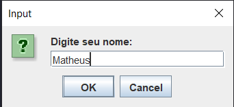
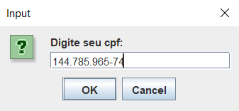
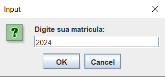
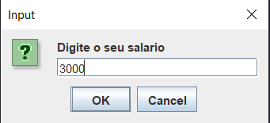

## 📚Sobre

**javaExercicio01** - Primeiro exercicio do curso Java fullstack develloper da coti informatica.
O exercicio trata-se de um cadastro de usuario, onde será cadatrado nome, cpf, matricula e salario, além de gerar um id automático com UUID e guardar esses dados em um arquivo .txt 

Aluno: Matheus Peluso
Professor: Sergio Mendes 

## 🏜️ Fotos do projeto
<div align="center">
    
    
    
    
    
</div>


## Como executar o projeto
```bash
    # clone o projeto
    git clone https://github.com/matheuspeluso/javaExercicio01.git
    
```

## depencia para o projeto funcionar 
    - Jdk 21.0.4
    
Também é necessario criar uma pasta 'dados' dentro do disco C:\